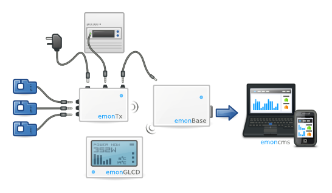

**Welcome to EmonHub Documentation**
----------------------------------
----------------------------------

### *emonHub connects your inputs with emonCMS*

Currently the OpenEnergyMonitor projects most popular emonBase option is the Raspberry Pi, usually  either as a standalone forwarder running the OEM gateway or as a full emonCMS server installation running either the python or php input scripts. The emonHub software was designed to unify these approaches into one multipurpose software that can run independantly as a forwarder or the same machine as a emonCMS installation.

